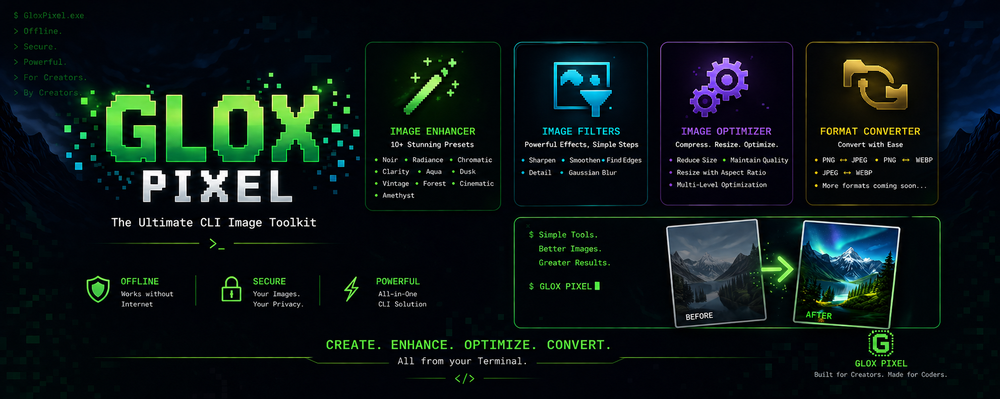
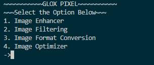
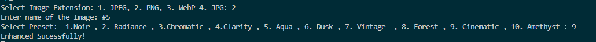
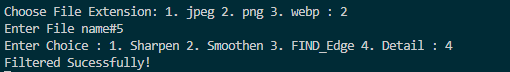
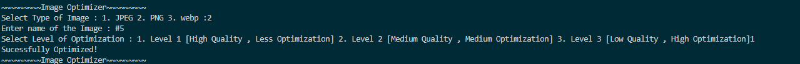

# 🖼️ GLOX Pixel

<p align="center">
  
</p>

<p align="center">
  <strong>Offline • Secure • Fast • Python CLI Image Toolkit</strong>
</p>

GLOX Pixel is a lightweight, Python-based Command Line Image Processing Toolkit built using the Pillow (PIL) library. It allows you to enhance, filter, optimize, and convert images directly from your terminal without relying on cloud services or an internet connection.

Designed with simplicity and speed in mind, GLOX Pixel provides useful image editing utilities while keeping everything completely offline, ensuring your files remain private and secure.


---

# ✨ Features

## 🎨 Image Enhancement Presets

Apply professionally tuned presets to your images.

- Noir
- Radiance
- Chromatic
- Clarity
- Aqua
- Dusk
- Vintage
- Forest
- Cinematic
- Amethyst

---

## 🖌️ Image Filters

Apply built-in Pillow filters with a single command.

- Sharpen
- Smooth
- Detail
- Find Edges

---

## ⚡ Image Optimization

Reduce image size while maintaining quality.

### JPEG / WEBP

- Level 1 – High Quality
- Level 2 – Balanced
- Level 3 – Maximum Compression

### PNG

- Compression Level 1
- Compression Level 2
- Compression Level 3

---

## 🔄 Image Format Conversion

Convert images between popular formats.

Supported formats include:

- PNG
- JPEG
- JPG
- WEBP

---

# 📷 CLI Showcase

## Main Menu

<p align="center">

</p>

---

## Image Enhancement

<p align="center">

</p>

---

## Image Filtering

<p align="center">

</p>

---

## Image Optimization & Conversion

<p align="center">

</p>

---

# ⚙️ How It Works

GLOX Pixel follows a simple CLI workflow.

1. Launch the application.
2. Select the desired feature.
3. Choose the image format.
4. Enter the image filename.
5. Select the required preset, filter, optimization level, or output format.
6. The processed image is automatically saved in the current directory with an appropriate prefix.

Example output filenames:

```
Noir_photo.jpg
Radiance_image.png
sharp_picture.webp
OptL2_wallpaper.jpeg
```

---

# 📦 Requirements

- Python 3.10+
- Pillow

Install Pillow:

```bash
pip install pillow
```

---

# 🚀 Running GLOX Pixel

```bash
python main.py
```

---

# 📁 Project Structure

```
GLOX-Pixel/
│
├── main.py
├── gloxbanner.png
├── img1.png
├── img2.png
├── img3.png
├── img4.png
└── README.md
```

---

# 🔒 Offline & Secure

- No Internet Required
- No Cloud Processing
- No Image Uploads
- All processing happens locally on your machine.

---

# 🛠 Built With

- Python
- Pillow (PIL)

---

# 📄 License

This project is licensed under the MIT License.

---

<p align="center">
Made with ❤️ using Python
</p>


Credits : AvgLucer | Gaurav W


# ⚠️ Educational & Reference Use Only


> [!WARNING]
> ## Academic Integrity Notice
>
> This repository is published **solely for educational, learning, portfolio, and reference purposes**.
>
> You are welcome to:
> - ✅ Study the source code
> - ✅ Learn from the implementation
> - ✅ Experiment and modify it for personal learning
> - ✅ Build your own projects inspired by this work
>
> **However, you must NOT:**
> - ❌ Submit this repository (or a lightly modified version) as your own assignment or coursework.
> - ❌ Present this project as your own work in any **school, college, university, bootcamp, internship, hackathon, certification, or academic evaluation.**
> - ❌ Claim authorship of this project or any substantial portion of its implementation.
>
> If this project helps you, the expected approach is to **learn from it and create your own original implementation.** Please respect academic integrity and the time invested in developing this project.
